# [raigon](https://raigonlab.github.io/raigon-mmxi)

Developer: Railson Goncalves ([raigonlab](https://www.github.com/raigonlab))

[](https://www.github.com/raigonlab/raigon-mmxi/commits/main)
[](https://www.github.com/raigonlab/raigon-mmxi/commits/main)
[](https://www.github.com/raigonlab/raigon-mmxi)
[](https://raigonlab.github.io/raigon-mmxi)

---

## Project Introduction and Rationale

raigon is an interactive digital art gallery presenting the original works of Raigon, a Zürich-based artist and tattooist. The target audience includes art collectors interested in acquiring or commissioning work, and fellow artists and creatives who engage with the work conceptually. The site is built as a single-page application using HTML, CSS, and JavaScript, with no external frameworks or libraries.

The project is structured around two levels of access: a public gallery open to all visitors, and a private, invitation-only space for the *Accord* collection, protected by an access code gate. Acquisition happens through curated contact forms and direct artist–collector communication, not a traditional e-commerce flow.

The site currently presents two collections — *Carvão Digital* and *Accord* — with a third marked as coming soon. The Arquive section lists upcoming events loaded asynchronously from a local JSON file, and a contact form with custom validation allows visitors to reach the artist directly.

The key technical decisions were: a single-page architecture with hash-based routing so back/forward navigation works natively; the Fetch API with `async/await` and `try/catch` for event data loading, keeping the UI responsive while the request resolves; and all interactivity built without frameworks to demonstrate direct control over the DOM and browser APIs.

The long-term vision is to evolve this system into a framework that other independent artists can use to present and manage their work online, reducing dependence on traditional platforms.

#### [Live site →](https://raigonlab.github.io/raigon-mmxi)

---


*source: https://ui.dev/amiresponsive?url=https://raigonlab.github.io/raigon-mmxi*

---

## UX

### The 5 Planes of UX

#### 1. Strategy

**Purpose**

- Present original digital artwork in an immersive, contemplative gallery
- Provide differentiated access: a public exhibition and a private, invitation-only space for collectors
- Support a personal acquisition flow through curated forms and direct artist–collector communication
- Allow users to explore collections and contact the artist directly

**Primary User Needs**

- Browse and view artwork with full detail
- Understand the artist's visual identity and body of work
- Find contact information easily

**Business Goals**

- Attract collectors and commission inquiries through a personal acquisition flow
- Establish a strong, distinct visual identity online
- Validate the portfolio experience as a first phase toward a broader framework for independent artists
- Demonstrate technical and design craftsmanship

---

#### 2. Scope

**Features**

- Infinite parallax gallery with depth-of-field effect
- Full-screen artwork modal with keyboard navigation
- Accord collection with access code gate
- Curated collections loaded from inline data
- Upcoming events loaded via async fetch with loading and error states
- Two validated forms: contact and artwork inquiry
- Artist biography with expandable content
- Custom 404 page with automatic redirect

**Content Requirements**

- Original artwork images with title, series, year, and description
- Artist biography
- Contact and social media links

---

#### 3. Structure

**Information Architecture**

- Single-page application with three sections: Home, Vault, Arquive
- Hash-based routing — URL updates on navigation so back/forward buttons work natively
- Persistent bottom navigation pill bar
- No page reloads — all transitions are JavaScript-driven

**User Flow Desktop**

1. User lands on the Home gallery
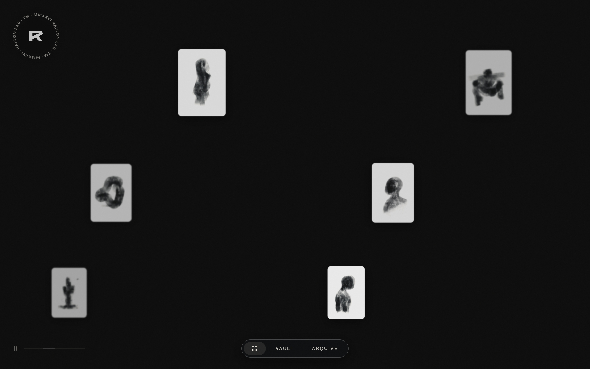

2. Drags or scrolls to explore the artwork


3. Clicks an artwork to open the full-screen modal


4. Navigates to Vault to explore collections
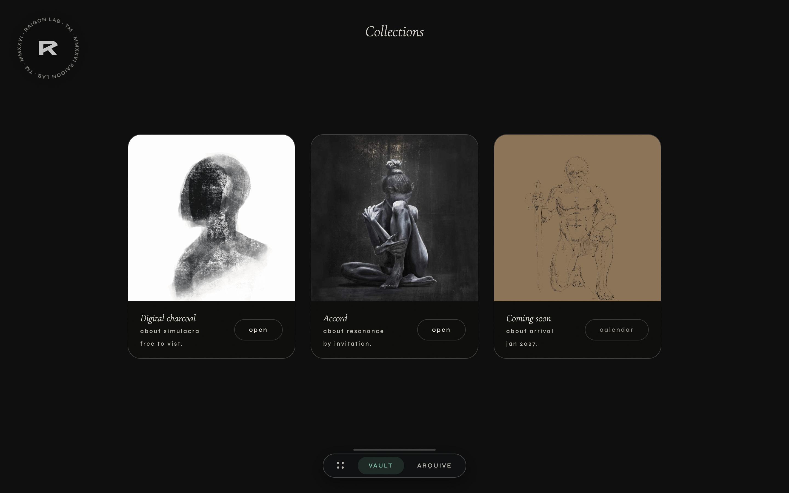

5. Navigates to Arquive to find contact information


6. Visits a broken or unknown URL and is shown the custom 404 page
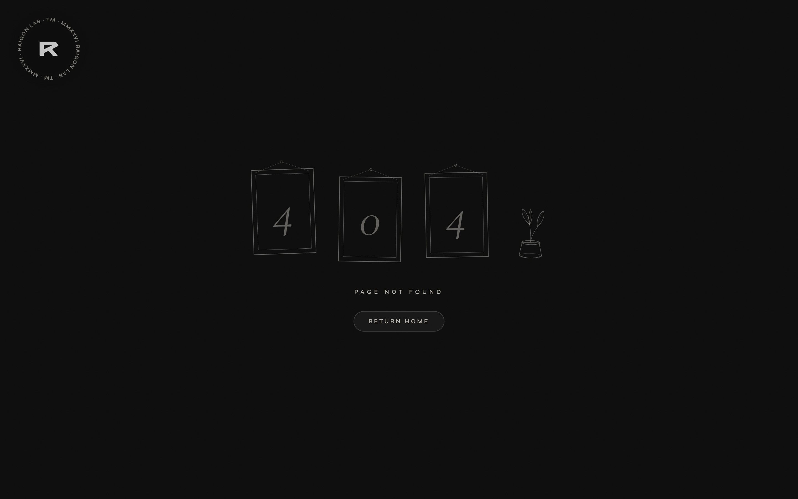

**User Flow Mobile**

1. User lands on the Home gallery


2. Swipes to explore the artwork


3. Taps an artwork to open the modal


4. Navigates to Vault


5. Navigates to Arquive


6. Visits a broken or unknown URL and is shown the custom 404 page
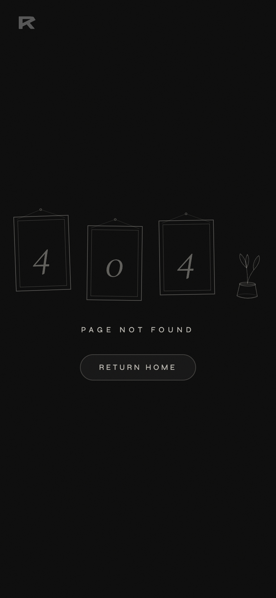

---

#### 4. Skeleton

Low-fidelity sketches were created first to define content placement and user flow, before moving on to more detailed wireframes.


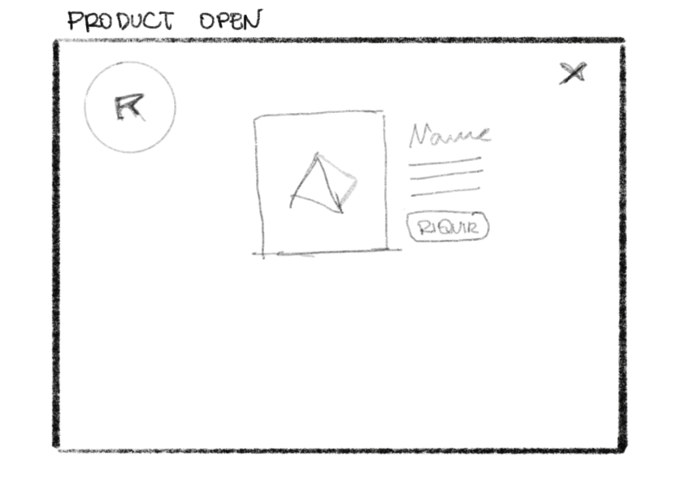

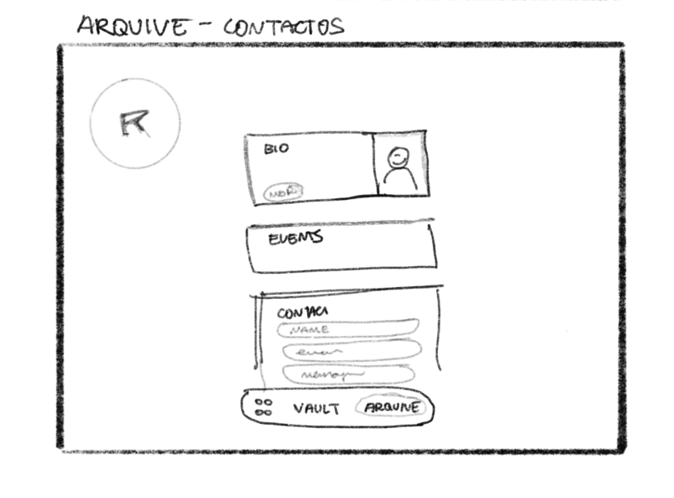

---

#### 5. Surface

**Visual Design**

- Minimal dark interface — near-black backgrounds with warm accent (`#c4622d`)
- Editorial typography pairing: Cormorant Garamond (serif) for artwork information, Syne (geometric sans) for UI labels
- Artwork is always the visual priority — interface elements are intentionally subdued

---

## Colour Scheme

Dark, editorial scheme centred on the artwork:

| Token | Value |
| ------- | ------- |
| Background | `#1c1916` |
| Secondary | `#1a2a3a` |
| Accent Secondary | `#4a7c6a` |
| Accent | `#c4622d` |
| Text | `#e8e4dc` |

Clean, minimal, and designed to frame artwork without competing with it.

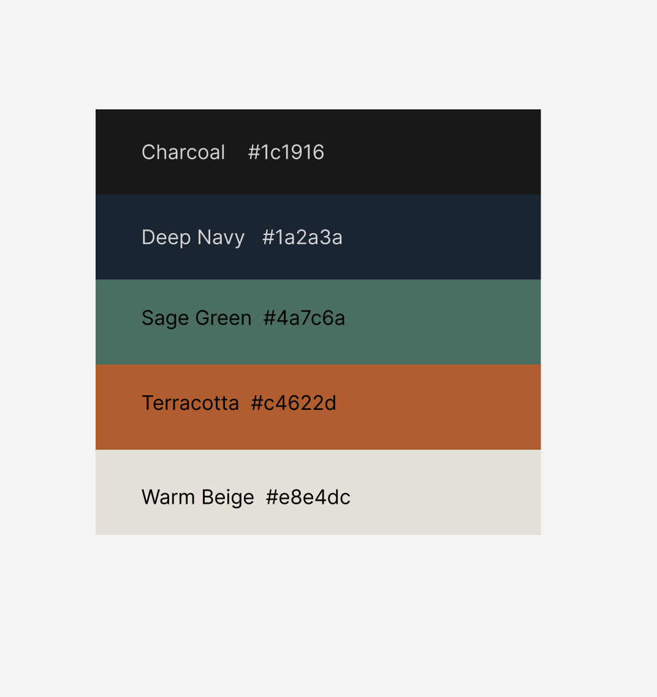

---

## Typography

- **Cormorant Garamond** — used for artwork titles, descriptions, and editorial content. Sourced from Google Fonts.
- **Syne** — used for navigation labels, section headers, and UI elements. Sourced from Google Fonts.

The pairing creates a clear visual hierarchy: Cormorant Garamond carries the artistic voice, Syne handles the interface.

---

## Wireframes

Wireframes were created using Figma to define layout and structure across devices before any code was written. The process started with low-fidelity sketches focused on content placement and user flow, then moved to more defined layouts covering both mobile and desktop breakpoints.

| Screen | Wireframe |
| ------ | --------- |
| Home (gallery) | 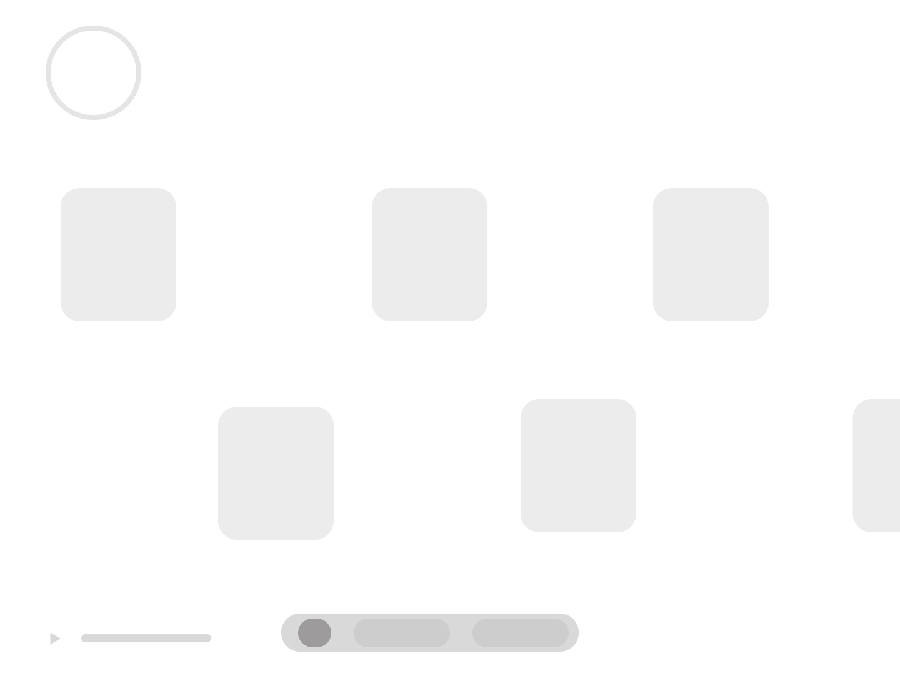 |
| Artwork Modal | 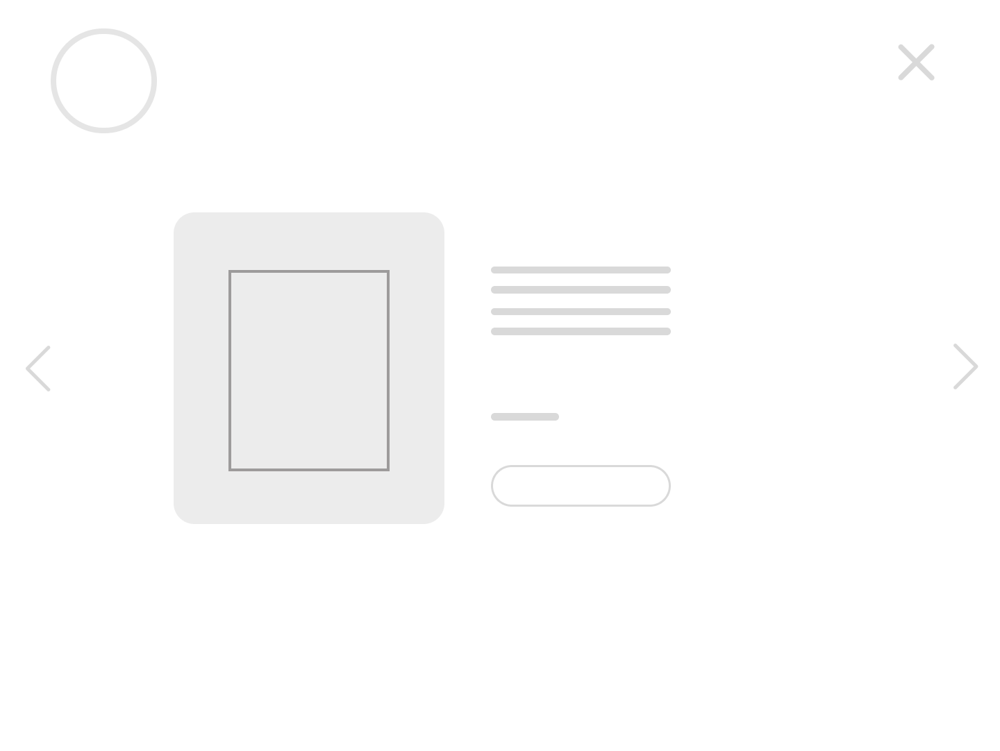 |
| Vault | 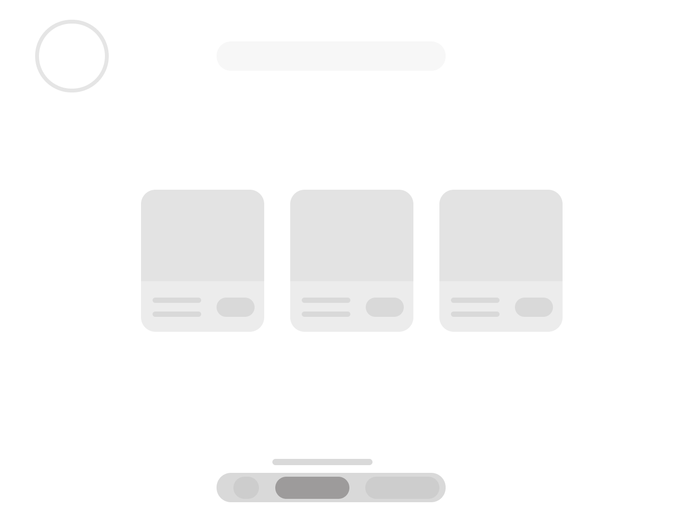 |
| Arquive | 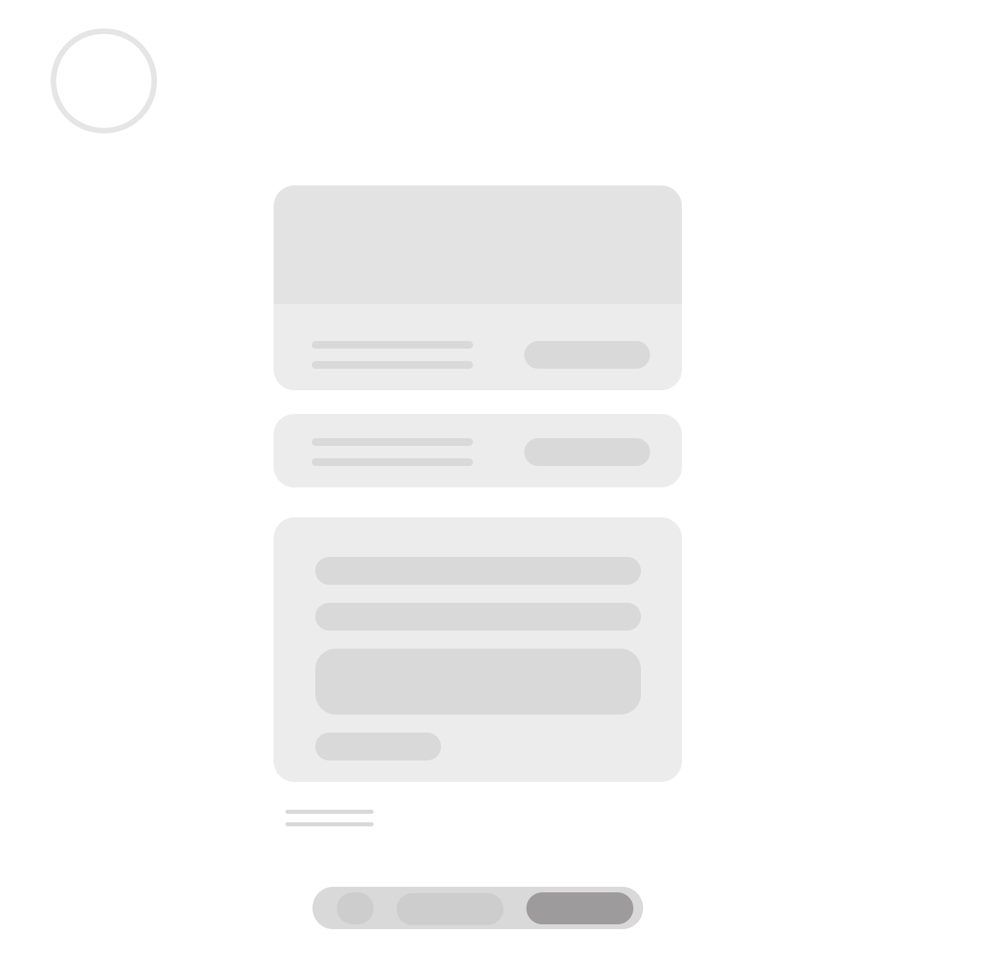 |

---

## User Stories

| Target | Expectation | Outcome |
| ------ | ----------- | ------- |
| As an art collector | I want to browse artwork in a visually immersive gallery | So I can evaluate pieces for acquisition |
| As a visitor | I want to view an artwork in full detail | So I can see the title, series, year, and description |
| As a visitor | I want to navigate between artworks without closing the viewer | So my browsing flow is uninterrupted |
| As an art collector | I want to inquire about acquiring a piece through direct contact | So I can begin a personal conversation with the artist |
| As a creative / peer artist | I want to understand the artist's visual language | So I can engage meaningfully with the work |
| As a creative / peer artist | I want to explore curated collections by theme | So I can discover conceptual groupings |
| As a site visitor | I want to find contact information easily | So I can get in touch or follow on social media |
| As a site visitor | I want to use the site on any device | So I have a consistent experience on mobile and desktop |
| As a site visitor | I want feedback when my actions produce a result | So I always know what the site is doing |
| As a site visitor | I want a 404 page | So I know when something has gone wrong |

---

## Features

### Existing Features

| Feature | Description |
| ------- | ----------- |
| Parallax Gallery | Three-layer infinite horizontal scroll with auto-scroll, drag, mouse-edge scroll, and play/pause control |
| Depth-of-field Effect | Cards blur, fade, and scale based on distance from screen centre, calculated per animation frame |
| Artwork Modal | Full-screen viewer with title, series, year, description, and prev/next navigation |
| Keyboard Navigation | Arrow keys navigate between artworks; Escape closes the modal |
| Swipe Navigation | Swipe left/right on mobile to browse artworks inside the modal |
| Inquire Form | Inline acquisition form inside the modal with field validation and success state |
| Vault Collections | Two collections (*Carvão Digital* and *Accord*) plus a coming-soon card with calendar link |
| Accord Access Gate | Invitation-only collection protected by an access code, with error feedback and two-step success flow |
| Async Event Loading | Upcoming events fetched from `data/events.json` with loading indicator and error state |
| Google Calendar Link | Event data used to generate an Add to Calendar link via `URLSearchParams` |
| Contact Form | Validated contact form with inline field errors and a success overlay on submission |
| Hash Routing | URL hash updates on navigation; browser back/forward buttons work without page reloads |
| Bio Card | Expandable artist biography with animated height transition |
| 404 Page | Custom error page with automatic redirect to homepage |
| Favicon | SVG and PNG branding elements |

---

### Future Features

- Search and filter for the gallery
- Individual collection gallery views
- Private collector portal with persistent access
- Framework expansion to support other independent artists

---

## Tools & Technologies

- HTML5
- CSS3
- JavaScript (ES6+)
- Fetch API
- Git & GitHub
- GitHub Pages
- Figma
- Google Fonts
- ChatGPT / Claude

---

## Agile Development Process

GitHub Projects and Issues were used to plan and track the development.

[Link to Project Board](https://github.com/users/raigonlab/projects/2)

---

## Testing

All testing details are available in:

👉 [TESTING.md](TESTING.md)

---

## Deployment

### Live Website

The site was deployed to GitHub Pages. The steps to deploy are as follows:

1. In the GitHub repository, navigate to the **Settings** tab
2. From the **Code and automation** section drop-down menu, select **Pages**
3. In the build and deployment area, choose from source **"deploy from a branch"** and then choose the **main** branch, **root** folder, and save
4. Once saved, the page will be automatically refreshed with a ribbon confirming successful deployment (it can take around 5 minutes for the link to appear)

**Live link:** https://raigonlab.github.io/raigon-mmxi

### Local Development

To run the project locally:

1. Clone the repository:
   ```
   git clone https://github.com/raigonlab/raigon-mmxi.git
   ```
2. Navigate into the project folder:
   ```
   cd raigon-mmxi
   ```
3. Start a local server — either with the VS Code Live Server extension, or via terminal:
   ```
   python -m http.server
   ```
4. Open `http://localhost:8000` in your browser.

> **Note:** opening `index.html` directly via `file://` will cause a CORS error that blocks the `fetch()` call for event data. A local server is required.

---

## Credits

### Content

- [MDN Web Docs](https://developer.mozilla.org/) — Fetch API and DOM reference
- Code Institute materials
- Claude — coding assistant for debugging and project support
- ChatGPT — debugging and explanations
- Gemini — image generation
- [fonts.google.com](https://fonts.google.com)
- [fireship.dev](https://fireship.dev)
- [tinypng.com](https://tinypng.com) — image compression
- ResponsivelyApp - manage screenshot

### Media

- All artwork pieces by Railson Gonçalves (© Raigon Lab, MMXXIII)
- Logo and symbol images are original works by Railson

---

## Acknowledgements

Special thanks to my mentor Tim Nelson for his guidance and support throughout the project, and to Tindy and Fernando Gonçalves for all their support.

---
